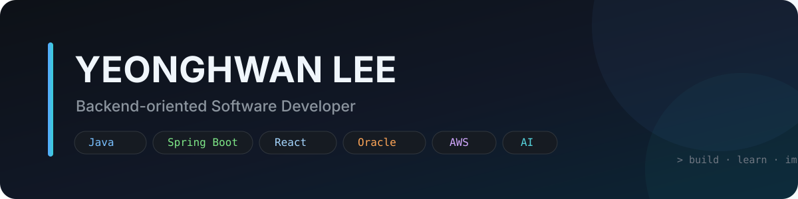

<picture>
  <source media="(prefers-color-scheme: dark)" srcset="./assets/header-dark.svg">
  <source media="(prefers-color-scheme: light)" srcset="./assets/header-light.svg">
  
</picture>

## 👋 About Me

안녕하세요. **Java와 Spring 기반 Backend 개발을 중심으로 서비스 전체 흐름을 이해하고 만들어가는 개발자 Yeonghwan Lee입니다.**

기업용 ERP와 업무 시스템을 개발·유지보수하며 **안정적인 구조, 공통화, 재사용 가능한 기능 설계**에 관심을 가져왔습니다.  
Backend뿐 아니라 React/Next.js 기반 Frontend와 AWS/Linux 기반 운영 환경까지 직접 다루며, 기능 구현을 넘어 **서비스가 실제로 동작하고 운영되는 과정 전체**를 이해하는 개발자를 지향합니다.

최근에는 **Spring AI, LLM, RAG와 기존 업무 시스템의 AI 연계**에 관심을 가지고 학습하고 있습니다.

---

## 💼 Experience

### Enterprise Application Development
- Java / Spring Boot / Oracle / MyBatis 기반 기업용 ERP 및 업무 시스템 개발·유지보수
- 공통 기능 개선, 기술 문의 대응 및 재사용 가능한 기능 설계
- Legacy 환경을 분석하고 점진적으로 현대화하기 위한 구조와 기술 검토

### Cloud & Web Infrastructure
- Linux / Nginx / PostgreSQL 기반 웹 서비스 운영 환경 구성 경험
- AWS 기반 메일 발송 및 이벤트 처리 구조 구성 경험
- 서비스 배포부터 인증서, 네트워크, 로그 흐름까지 운영 관점에서 문제를 분석하고 개선

---

## 🛠 Tech Stack

### Core Backend

  
  
  
  

### Frontend

  
  
  
  

### Database

  
  

### Infrastructure & Tools

  
  
  
  
  

---

## 🚀 Featured Projects

<table>
<tr>
<td width="50%" valign="top">

### 💌 [MyWeddingCard](https://github.com/Leeeyounghwan/MyWeddingCard)

직접 기획하고 구현한 모바일 청첩장 서비스입니다.

**주요 포인트**
- React 19 + TypeScript 기반 UI
- Supabase PostgreSQL / RLS / RPC
- 모바일 성능을 고려한 지연 로딩
- GitHub Actions → GitHub Pages 자동 배포
- 지도, 방명록, RSVP, 공유 기능 구현

`React` `TypeScript` `Vite` `Supabase`

</td>
<td width="50%" valign="top">

### 🥕 [Daangn Clone](https://github.com/Leeeyounghwan/daangn_clone)

Django 기반 중고 거래 플랫폼 클론 프로젝트입니다.

**주요 포인트**
- 상품 등록 및 거래 흐름 구현
- 지역 설정 / 채팅 / 관심 목록
- GPT API를 활용한 글 작성 및 챗봇 기능
- 팀 프로젝트 협업 경험

`Django` `Python` `PostgreSQL` `OpenAI API`

</td>
</tr>
</table>

---

## 🔨 Currently Building

### 🏸 [PlayCock](https://github.com/Leeeyounghwan/PlayCock)
배드민턴 모임의 일일 경기 운영을 효율화하기 위한 **경기 관리 서비스**를 개발하고 있습니다.

참가자 관리, 대기열, 코트 배정, 경기 이력, 통계 등 실제 모임 운영에서 발생하는 문제를 소프트웨어로 해결하는 것을 목표로 합니다.

---

## 🌱 Currently Exploring

- **Spring AI**를 활용한 Java/Spring 기반 AI Application
- **LLM / RAG / AI Agent**와 기존 Enterprise System 연계
- Spring Boot 3 / JDK 21 기반의 Modern Backend Architecture
- React + TypeScript 기반 Frontend 구조 및 사용자 경험 개선

---

## 📊 GitHub

> GitHub 통계와 언어 비율은 공개 저장소를 기준으로 하며, 실제 실무 경험 전체를 의미하지 않습니다.

---

## 📫 Contact

새로운 기술과 문제 해결에 대해 이야기하는 것을 좋아합니다.

**Email** · [lee.yhwan226@gmail.com](mailto:lee.yhwan226@gmail.com)  
**GitHub** · [github.com/Leeeyounghwan](https://github.com/Leeeyounghwan)

  Built for clarity, maintained with curiosity.

